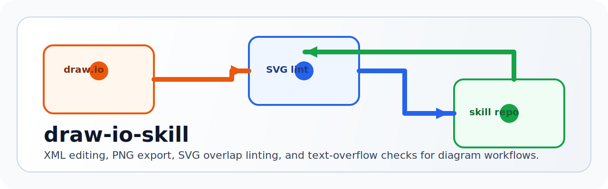

<p align="center">
  
</p>

<p align="center">
  <a href="./README.ja.md">日本語</a> · <strong>English</strong>
</p>

<p align="center">
  <a href="https://github.com/Sunwood-ai-labs/draw-io-skill/actions/workflows/ci.yml"></a>
  <a href="./LICENSE"></a>
  
  
</p>

<p align="center">
  A reusable skill for draw.io diagram editing, PNG export, SVG overlap linting, and text-overflow checks.
</p>

## ✨ Overview

`draw-io-skill` packages a practical draw.io workflow for agent-driven editing:

- edit `.drawio` XML safely and predictably
- export transparent PNG or SVG outputs
- lint SVGs for edge overlap, box penetration, and text overflow
- reuse AWS icon search helpers and layout guidance

This repository is based on the original `draw-io` skill from [softaworks/agent-toolkit](https://github.com/softaworks/agent-toolkit/blob/main/skills/draw-io/README.md), with local additions focused on automated QA for diagram readability.

## 🚀 Quick Start

### Install into a Codex-style skill directory

Clone this repository somewhere stable, then connect it into your skill folder.

#### Windows junction example

```powershell
git clone https://github.com/Sunwood-ai-labs/draw-io-skill.git D:\Prj\draw-io-skill
cmd /c mklink /J C:\Users\YOUR_NAME\.codex\skills\draw-io D:\Prj\draw-io-skill
```

#### Unix symlink example

```bash
git clone https://github.com/Sunwood-ai-labs/draw-io-skill.git ~/Prj/draw-io-skill
ln -s ~/Prj/draw-io-skill ~/.codex/skills/draw-io
```

### Validate the bundled lint script

```bash
npm install
npm run check
```

## 🧰 What This Skill Adds

### Diagram authoring workflow

- `.drawio` XML editing guidance
- draw.io CLI export commands for PNG and SVG
- layout rules for spacing, arrows, and Japanese text width

### SVG linting

The included script [scripts/check-drawio-svg-overlaps.mjs](./scripts/check-drawio-svg-overlaps.mjs) checks:

- `edge-edge` crossings and collinear overlaps
- `edge-rect` penetration where arrows travel through boxes
- `text-overflow(width)` and `text-overflow(height)` using the companion `.drawio`

Example:

```bash
drawio -x -f svg -o docs/diagram.drawio.svg docs/diagram.drawio
node scripts/check-drawio-svg-overlaps.mjs docs/diagram.drawio.svg
```

## 📦 Repository Layout

```text
draw-io-skill/
├── README.md
├── README.ja.md
├── SKILL.md
├── LICENSE
├── assets/
│   └── draw-io-skill-hero.svg
├── fixtures/
│   └── basic/
│       ├── basic.drawio
│       └── basic.drawio.svg
├── references/
│   ├── aws-icons.md
│   └── layout-guidelines.md
└── scripts/
    ├── check-drawio-svg-overlaps.mjs
    ├── convert-drawio-to-png.sh
    └── find_aws_icon.py
```

## 🛠 Requirements

- Node.js 20+
- draw.io CLI for export commands
- optional Python for `find_aws_icon.py`

## ✅ Development Checks

Run the local structural check:

```bash
npm run check
```

This currently validates:

- Node syntax for the SVG lint script
- bundled fixture linting for a known-good `.drawio` / `.svg` pair

## 🧪 Example Commands

### Export PNG

```bash
drawio -x -f png -s 2 -t -o architecture.drawio.png architecture.drawio
```

### Export SVG

```bash
drawio -x -f svg -o architecture.drawio.svg architecture.drawio
```

### Run overlap and overflow lint

```bash
node scripts/check-drawio-svg-overlaps.mjs architecture.drawio.svg
```

### Search AWS icons

```bash
uv run python scripts/find_aws_icon.py lambda
```

## 📘 Included Guides

- [SKILL.md](./SKILL.md): the skill instructions used by agents
- [references/layout-guidelines.md](./references/layout-guidelines.md): layout rules
- [references/aws-icons.md](./references/aws-icons.md): AWS icon references

## 🤝 Attribution

This repository is derived from the original `draw-io` skill in `softaworks/agent-toolkit` and keeps that source clearly attributed while extending it with repository-ready lint tooling and polish.

## 📄 License

[MIT](./LICENSE)
